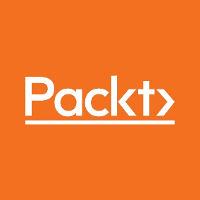
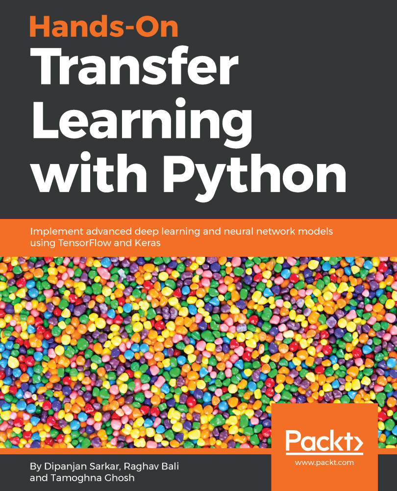

# Hands-On Transfer Learning with Python
### Implement advanced deep learning and neural network models using Tensorflow and Keras

With the world moving towards digitalization and automation, as a technologist/programmer it is important to keep oneself updated and learn how to leverage these tools and techniques. Hands-On Transfer Learning with Python, is an attempt to help practitioners get acquainted with and equipped to use these advancements in their respective domains. This book is structured broadly into three sections:
+ Deep learning foundations
+ Essentials of transfer learning
+ Transfer learning case studies

This repository contains all the code, notebooks and examples used in this book. We will also be adding bonus content here from time to time. So keep watching this space!

## Get the book
<table style="width:100%" >
  <tr>
    <td>
      
    </td>
    <td>
      
    </td>
    <td>
      
    </td>
  </tr>
</table>

## About the book

Transfer learning is a machine learning (ML) technique where knowledge gained during the training of one set of ML problems can be used to train other similar types of problems. The purpose of this book is two-fold. We focus on detailed coverage of deep learning and transfer learning, comparing and contrasting the two with easy-to-follow concepts and examples. The second area of focus will be on real-world examples and research problems using TensorFlow, Keras, and the Python ecosystem with hands-on examples.

The book starts with core essential concepts of ML and deep learning, followed by some depictions and coverage of important deep learning architectures, such as CNNs, DNNs, RNNs, LSTMs, and capsule networks. Our focus then shifts to transfer learning concepts and pretrained state of the art networks such as VGG, Inception, and ResNet. We also learn how these systems can be leveraged to improve performance of our deep learning models. Finally, we focus on a multitude of real-world case studies and problems in areas such as computer vision, audio analysis, and natural language processing (NLP). By the end of this book, you will be all ready to implement both deep learning and transfer learning principles in your own systems.

Edition: 1st &emsp; Pages: 438 &emsp; Language: English 
Book Title: Hands-On Transfer Learning with Python &emsp; Publisher: Packt 
Copyright: Sarkar, Bali & Ghosh &emsp; ISBN 13: 9781788831307 

 

## Key Features:
+ Build deep learning models with transfer learning principles in Python
+ Implement transfer learning to solve real-world research problems
+ Perform complex operations such as image captioning neural style transfer

 

## What You Will Learn:
+ Set up your own DL environment with graphics processing unit (GPU) and Cloud support
+ Delve into transfer learning principles with ML and DL models
+ Explore various DL architectures, including CNN, LSTM, and capsule networks
+ Learn about data and network representation and loss functions
+ Get to grips with models and strategies in transfer learning
+ Walk through potential challenges in building complex transfer learning models from scratch
+ Explore real-world research problems related to computer vision and audio analysis
+ Understand how transfer learning can be leveraged in NLP
